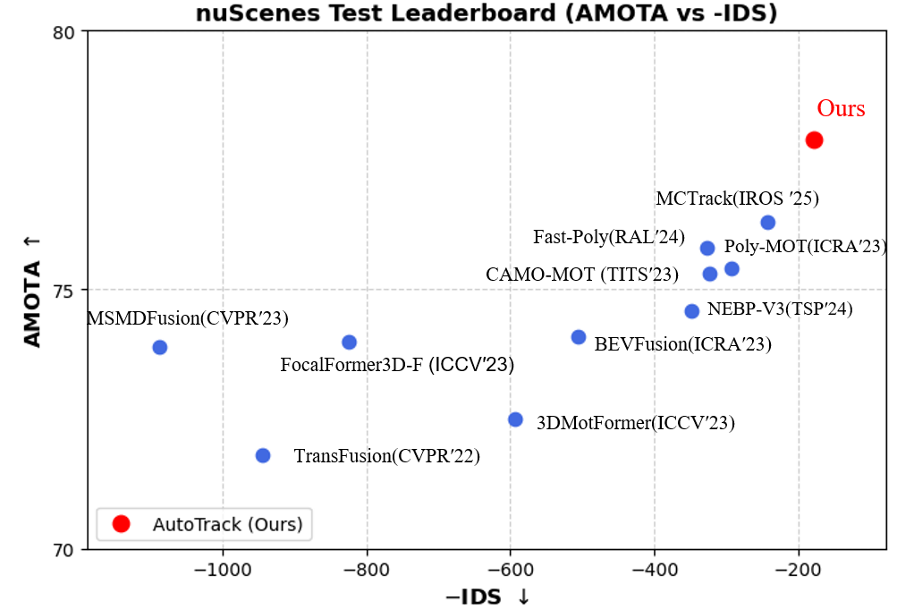

# AutoTrack

### [Youtube](https://youtu.be/RgQ2RkXjt44)
## Main Results

### [nuScenes](https://www.nuscenes.org/tracking?externalData=all&mapData=all&modalities=Any)

#### 3D Multi-object tracking on nuScenes test set   
[NuScenes Leaderboard](https://eval.ai/web/challenges/challenge-page/476/leaderboard/1321)   

 Method       | Detector      | AMOTA    | MOTA     | IDS      |   Model   |   log    |
--------------|---------------|----------|----------|----------|----------|----------|
 AutoTrack    | FocalFormer-F | 77.9     | 66.5     | 178      |       [result](https://www.nuscenes.org/tracking?externalData=all&mapData=all&modalities=Any)     |----------|

#### 3D Multi-object tracking on nuScenes val set   

 Method       | Detector      | AMOTA    | MOTA     | IDS      |   Model   |   log    |
--------------|---------------|----------|----------|----------|----------|----------|
 AutoTrack    | FocalFormer-F | 79.3     | 69.6     | 136      |       [result](https://www.nuscenes.org/tracking?externalData=all&mapData=all&modalities=Any)     |----------|
 

#### 3D Multi-object tracking on KITTI test set

  Method       | Detector      | HOTA      | MOTA     | IDS      |   Model  |   log    |
--------------|---------------|------------|----------|----------|----------|----------|
 AutoTrack    | Centerpoint   | 81.05      | 89.87    | 36       |      [result](https://www.nuscenes.org/tracking?externalData=all&mapData=all&modalities=Any)     |----------|

 https://eval.ai/web/challenges/challenge-page/476/leaderboard/1321

 
